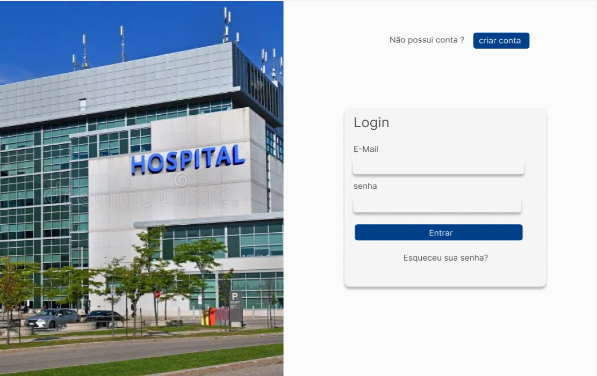
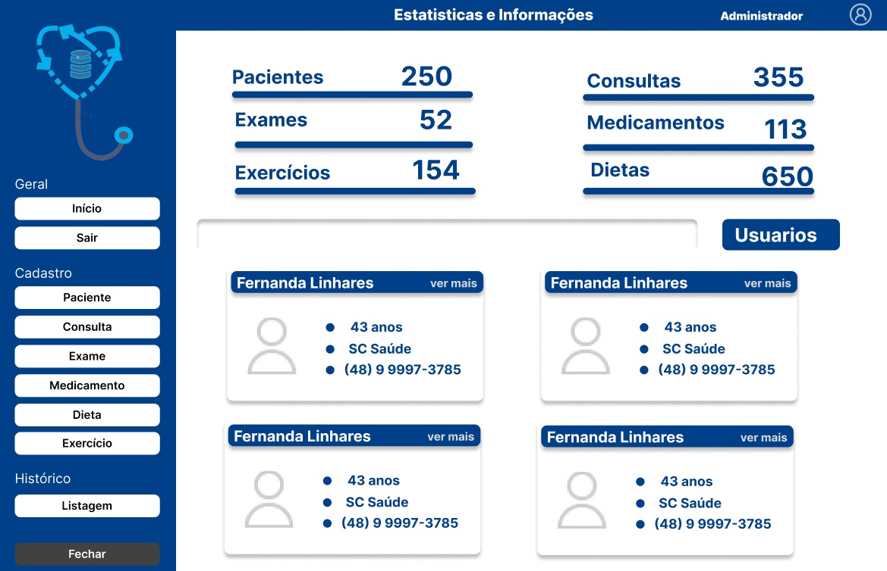
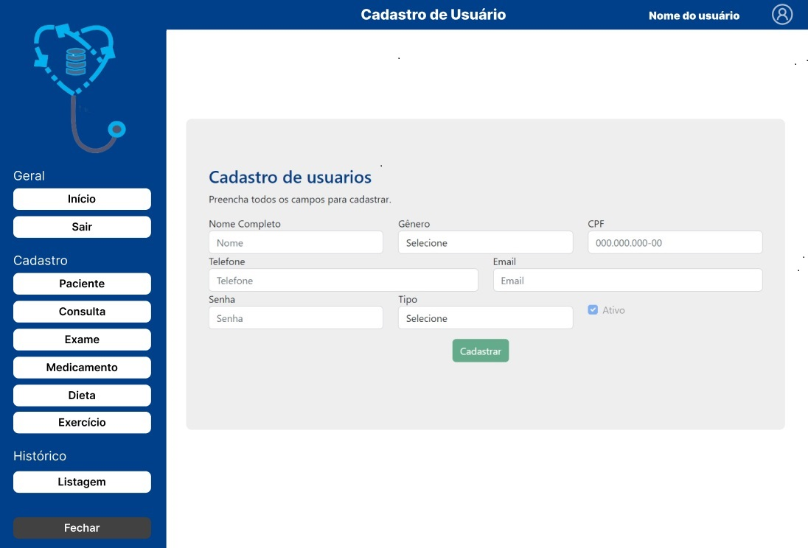
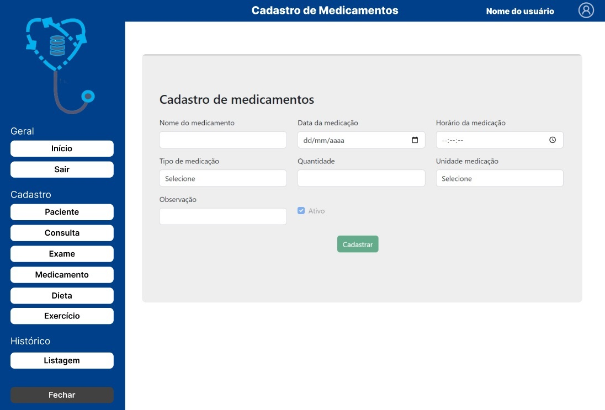
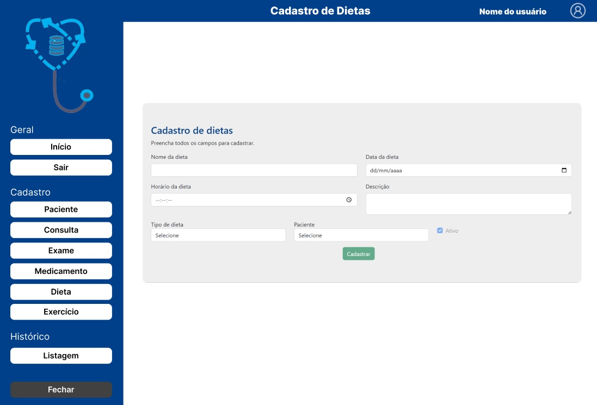

# Med Control

 

Desenvolvido pela LabMedication, o **MedControl**, é um software de gestão para uso em hospitais, clinicas e similares da área da saúde.
Com ele, o **administrador**, pode gerenciar quais usuários realizaram o atendimento, através de logs com mensagens e horários que foram 
realizados.
**Médicos** e **enfermeiros**, podem realizar: **cadastros**, **edições**,**listagem** e **edição** das **Consultas**, **Dietas**, **Exercícios**, **Medicamentos**, **Exames** atrelados aos **Pacientes**.
O modelo segue padrão **white-label** consiste em um software que pode ser personalizado com as cores, tipografias, logotipos e demais elementos visuais da identidade do cliente, proporcionando um resultado personalizado, podendo ser comercializado em todo o país.

## Tecnologia ultilizadas

 ## 
 
|[TypeScript](https://www.typescriptlang.org/)|
|[Javascript](https://developer.mozilla.org/pt-BR/docs/Web/JavaScript)|
|[Bootstrap](https://getbootstrap.com/)|
|[CSS](https://developer.mozilla.org/pt-BR/docs/Web/CSS)|
|[Figma](https://www.figma.com/)|
|[Angular](https://angular.io/cli/generate#guard-command)|
|[NPM](https://www.npmjs.com/package/ngx-toastr)|
|[Github](https://github.com)|

## Telas

## Como funciona o software

**Página de Login** para autenticação do usuário. Quando validados, serão redirecionados 
para pagina de início. Caso não estejam autenticados, alertas de falhas serão exibidos e o recurso da guarda de rota, que redicionará o **usuário** para a página inicial. Esta pagina possui um modal com informações de como cadastrar novos usuários e um botão para resetar a senha.

Após logado, a **Página inicial** (Estatísticas), apresentara a listagem das estatísticas do sistema com o número de todos cadastros realizados. Também conterá uma barra de busca do paciente por: nome, email ou telefone. e o resultado da busca em um card com as informações dos pacientes, contendo nome, idade, plano de saúde e contato de emergência. Caso o usuário, seja o administrador, ele conseguira realizar a busca dos usuários do sistema.

Em todas as páginas que o usuário esteja logado, conterá uma **navbar**, mostrando em que pagina do software o usuário se encontra, o nome do usuário logado no sistema e um ícone.
Estas páginas, também possuirão: um **menu** com rotas devidamente controladas pela guarda de rotas, possibilitando o acesso para outras páginas somente usuários autenticados. O menu conta ainda, com um botão, para recolher o menu, e um outro um botão para sair, redirecionando o usuário para tela de login.

- #### Cadastro de Usuário
- #### Cadastro de Paciente
- #### Cadastro de Consulta
- #### Cadastro de Exame
- #### Cadastro de Dieta
- #### Cadastro de Exercício
- #### Cadastro de Medicamentos

As telas de cadastros terão: formulário, botões para editar, deletar e salvar, que ficaram desativados durante o cadastro. Todos os dados, são validados, as informações são armazenadas no BD e apresentam uma mensagem de sucesso ou falha ao salvar.
A tela de **Listagem Prontuário**: possuirá uma barra de pesquisa, a listagem de pacientes cadastrados será exibida através de cards que contém um botão para abrir uma página, com os detalhes do paciente, mostrando as informações cadastradas, e o histórico de consultas, exames, medicamentos, dietas e exercícios.
A tela de **Prontuário do Paciente** disponibilizara: o histórico de consultas, exames, medicamentos, dietas e exercícios, com informações detalhadas de cada cadastro.

## Softwares necessários

Node.js (versão 14.x ou superior) npm

Para verificar se o Node.js e o npm estão instalados, abra o terminal e execute os seguintes comandos:

node -v npm -v

## Como rodar o projeto

#### Clone este repositório em sua máquina local:

git clone 
 (https://github.com/FullStack-Itacorubi/M3P-FrontEnd-Squad1Conectar a conta do Github)
##### Navegue até o diretório do projeto:

cd seu-projeto

##### Instale as dependências do projeto:

npm install

#### Inicie o servidor de desenvolvimento:

ng serve

#### Abra o navegador e acesse http://localhost:4200/ para visualizar o projeto em execução.

## Melhoria a serem aplicadas

#### Pagina de cadastro de paciente:

Incluir nome da mãe como atributo, para casos de homônimo

#### Cadastro consulta:

Incluir atributos como:

· Pressão arterial

· Pulsação

· Temperatura

· Frequência respiratória

· Saturação do oxigênio

· Frequência cardíaca

· Peso

· Altura

Utilizar o **CID( Classificação Internacional de Doenças)**  publicado pela Organização Mundial de Saúde (OMS) que visa padronizar a codificação de doenças e outros problemas. A cada estado é atribuída uma categoria única à qual corresponde um código CID que recebe um código de até seis caracteres de longitude (em formato de X00.000).
Cada uma das tais categorias pode incluir um grupo de doenças similares logo o uso de Enum com dois diagnósticos:

1. **Diagnostico principal CID**

2. **Diagnóstico secundário CID**

O CID na ficha do paciente, deve usar a criptografia, garantido a segurança e integridade do sistema.

Alterar o atributo de descrição do problema por Anamnese e incluir o exame físico utilizando um select com as seguintes opções:

#### Tipos de Exame :

· geral ( pele e mucosas),
· aparelho cardiovascular,
· respiratório, gastrointestinal,
· genitourinario,
· sistema nervoso central,
· membros superior e inferior.

#### Cadastro de exercícios

Acho que exercício pode ser substituído por atividade física e caso seja paciente de consultório, incluir fisioterapia e classificar através de Enum como motora ou respiratória.

Caso o público seja de paciente internado deixar apenas na fisioterapia.

#### Cadastro Dieta

Geralmente é usado tipo de dieta oral , enteral e parenteral.

###### Enum de Restrições necessárias:

· Hipossódica,
· Assódica,
· Sem açúcar,
· Pouco carboidrato,
· Pouca gordura.
· Diconstipante
· Rica em fibras.

###### Enum de Restrição de líquido.

· Ingestão de líquido
· Hipocalórica
· Hipercalórica

###### Enum de Tipo de dieta oral

· Sólida
· Pastosa
· Líquida

## Desenvolvedores

- Eduardo Veras (https://github.com/CesarVeras)

- Fernanda Linhares (https://github.com/FernandaBarrosLinhares)

- Geonani Andrade de Oliveira (https://github.com/G3ovani-Andrade)

- Isaque Scheidt (https://github.com/isaque-sch)

- Jose Francisco Dupuy Patella(https://github.com/josepatella)
